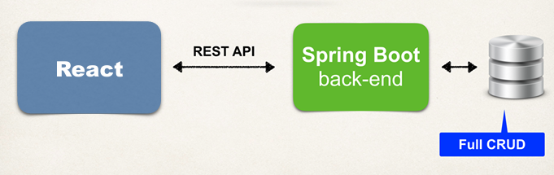

# FullStackLibraryApp

This is a full-stack Library Management Application built with **Spring Boot** (backend) and **React** (frontend).

## Architecture

This diagram illustrates the overall flow of the application, which consists of:

- **Frontend**: Built with React – handles user interaction and UI
- **Backend**: Built with Spring Boot – handles business logic and API services
- **Database**: MySQL – stores user data, book records, and reservations
  

## Project Structure

The app is organised in the following way:

```text
backend/     # Spring Boot backend application

frontend/    # React frontend application

start-files/ # Contains useful resources like SQL
               scripts for setting up database tables
               amd initial data
```
